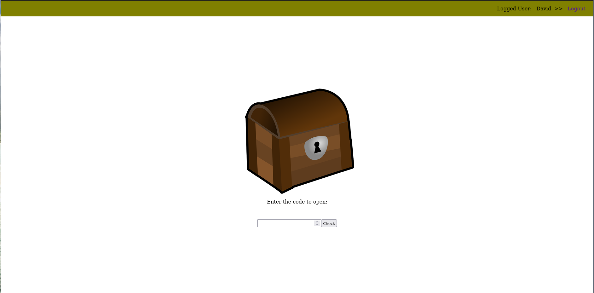
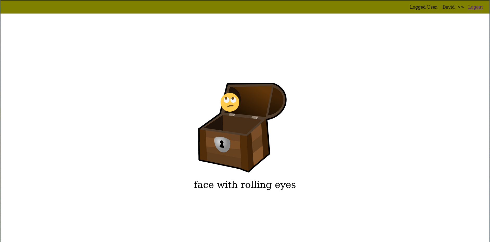

# ChestApp

Simple Spring Boot application, which use two services - Client and Resource Server.
On the Client Server we need to be Authenticated, wheras the Resource server return to us randomly selected emoji.
The secret code is: 123

Used technologies:
  - Spring Boot
  - Spring Security
  - Thymeleaf

---

After login we need enter the code:

---

If our code is valid, we open the box and we can see a emoji:

